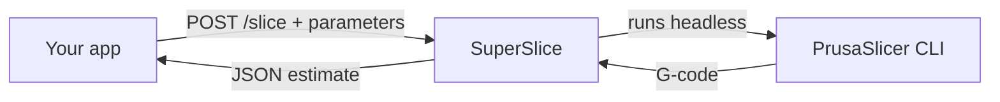

# SuperSlice

[](https://github.com/bintangtimurlangit/superslice/actions/workflows/docker-build.yml)
[](https://github.com/bintangtimurlangit/superslice/actions/workflows/tests.yml)
[](https://github.com/bintangtimurlangit/superslice/releases)
[](https://opensource.org/licenses/MIT)

A small REST API for **3D print estimation**. POST an STL or 3MF file and get
back the print time and filament usage a slicer would report — as JSON — so your
own app doesn't have to run a slicer. It does one thing: estimate. Pricing,
orders, and UI are left to the app that calls it.

It works by invoking **PrusaSlicer** headlessly and parsing the result.

## How it works



1. You upload an STL/3MF with the parameters you control: **layer height,
   infill density, wall count, and filament**.
2. SuperSlice runs PrusaSlicer headlessly on it — the same engine as the desktop
   app — producing real G-code.
3. It reads the summary PrusaSlicer writes into that G-code:

   ```
   ; estimated printing time (normal mode) = 19m 22s
   ; filament used [mm]  = 1506.53
   ; filament used [cm3] = 3.62
   ```

   then computes weight from filament density and returns JSON.
4. The upload and G-code are deleted immediately; nothing about your model is
   kept unless you enable history.

The numbers match what PrusaSlicer itself reports; accuracy depends on the
slicer profile (see [docs/ACCURACY.md](docs/ACCURACY.md)).

### Why PrusaSlicer 2.8.1?

It's pinned deliberately. PrusaSlicer 2.9+ is distributed for Linux as a Flatpak
only — it now depends on WebKitGTK, which is impractical to bundle in a slim
container — so 2.8.1 is the last release available as a self-contained Linux
AppImage, and it runs cleanly headless with no display or GPU.

## Quick start

Run the published image:

```bash
docker run -d --name superslice -p 8000:8000 \
  ghcr.io/bintangtimurlangit/superslice:latest
```

Or build from source: `docker compose up --build`. Either way the API is at
`http://localhost:8000` (interactive docs at `/docs`).

Slice a model:

```bash
curl -X POST http://localhost:8000/slice \
  -F "file=@model.stl" \
  -F "layer_height=0.2" -F "infill_density=20" -F "wall_count=3" \
  -F "filament_type=PLA"
```

```json
{
  "success": true,
  "print_time_formatted": "45m 30s",
  "print_time_minutes": 45.5,
  "filament_length_mm": 1234.56,
  "filament_volume_cm3": 2.98,
  "filament_weight_g": 3.69,
  "filament_type": "PLA"
}
```

→ Full endpoints, parameters, and error codes: **[docs/API.md](docs/API.md)**.
Prefer a GUI? Import the Postman collection at
[docs/superslice.postman_collection.json](docs/superslice.postman_collection.json).

## Documentation

| Doc | What's in it |
| --- | --- |
| [API.md](docs/API.md) | Endpoints (incl. async jobs & history), parameters, auth, errors |
| [CONFIGURATION.md](docs/CONFIGURATION.md) | Environment variables (incl. auth, rate limit, history) |
| [DEPLOYMENT.md](docs/DEPLOYMENT.md) | Running the image: Compose, reverse proxy, cloud |
| [ARCHITECTURE.md](docs/ARCHITECTURE.md) | How it's built and how an estimate is produced |
| [ACCURACY.md](docs/ACCURACY.md) | How realistic the numbers are, and how to improve them |
| [TROUBLESHOOTING.md](docs/TROUBLESHOOTING.md) | Common issues |

## Upcoming

Planned next (not built yet):

- **Printer & filament presets** — pick a bundled PrusaSlicer profile so
  estimates track a specific machine. This is the main accuracy lever.
- **Energy estimate** — optional wattage from a printer preset.

Already shipped: build-plate fit (`fits_build_volume`, default 256×256×256),
`requires_supports`, and the model bounding box are in every `/slice` response.

Out of scope by design: pricing, orders, and any UI. Those are built by the app
that calls SuperSlice (for example a 3D-printing website), not by SuperSlice
itself — it only returns the estimate.

## Local development

The app is a small FastAPI package; it needs a PrusaSlicer binary on the host.

```bash
python -m venv .venv && source .venv/bin/activate
pip install -r requirements-dev.txt
export PRUSASLICER_PATH=/path/to/prusa-slicer
export UPLOAD_DIR=./uploads OUTPUT_DIR=./output
uvicorn app.main:app --reload   # run from the repo root
pytest                          # run the tests (slicer is mocked)
```

See [CONTRIBUTING.md](CONTRIBUTING.md) for conventions and
[RELEASING.md](RELEASING.md) for the release process.

## License & attribution

SuperSlice's own code is [MIT](LICENSE) — use it freely, including commercially.

It bundles an **official, unmodified** build of **PrusaSlicer 2.8.1**
([AGPL-3.0](https://www.gnu.org/licenses/agpl-3.0.txt)), which it invokes as a
separate program;
[corresponding source](https://github.com/prusa3d/PrusaSlicer/releases/tag/version_2.8.1).
The distributed image as a whole therefore contains AGPL-3.0 software — keep
this attribution if you redistribute it. "PrusaSlicer" and "Prusa" are
trademarks of Prusa Research a.s.; SuperSlice is not affiliated with them.
